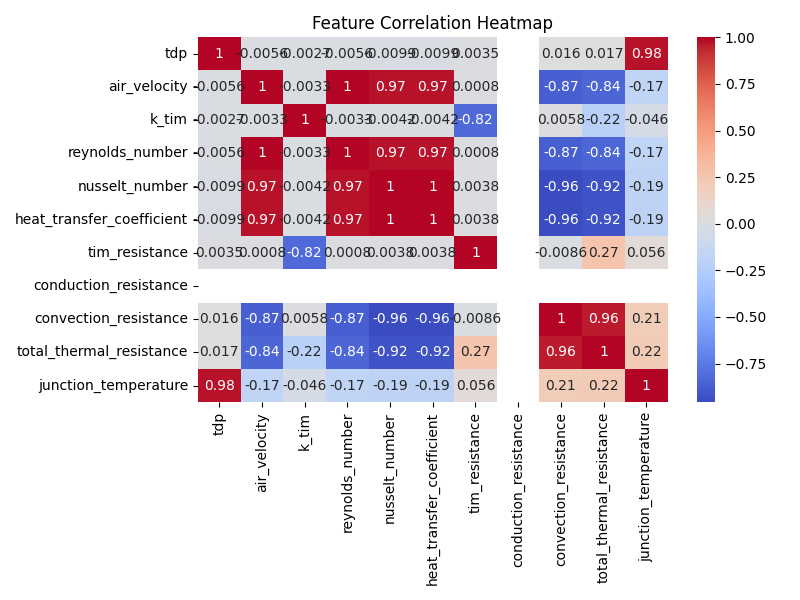
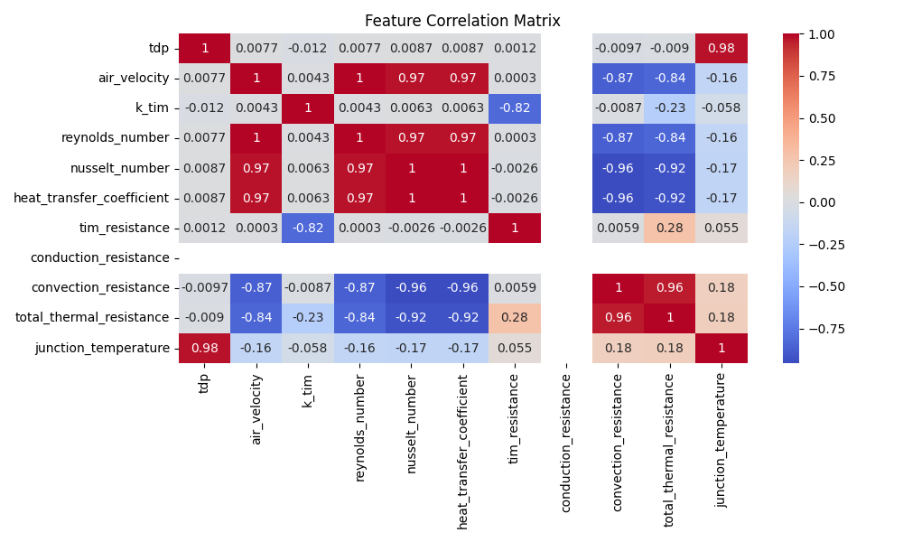
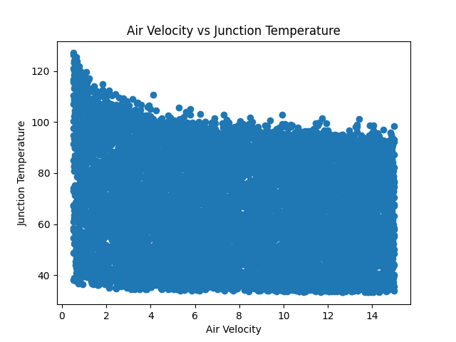
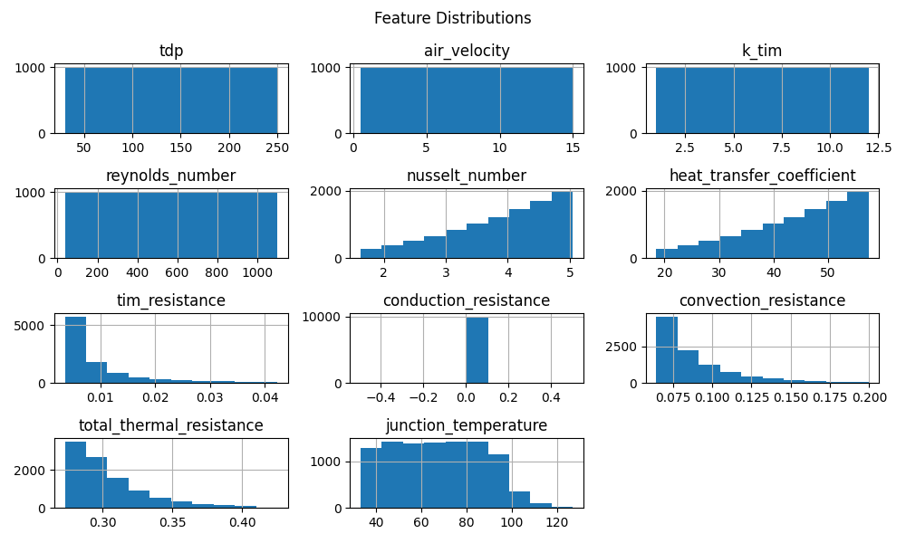
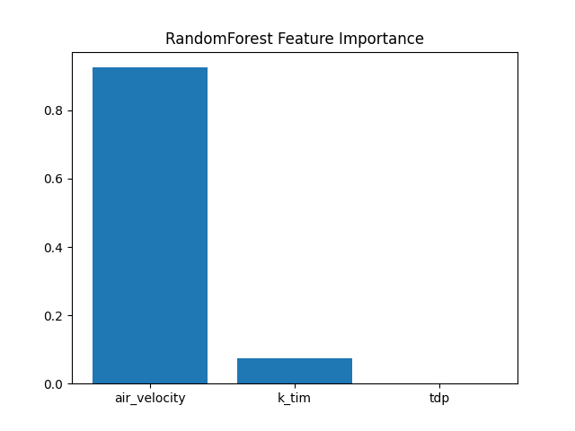
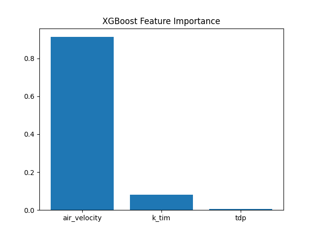

# README.md 

````md id="final_md_full"
# 🔥 Physics-Informed Heat Sink Surrogate Model

A machine learning-based surrogate modeling system for thermal analysis of heat sinks using physics-driven synthetic data generation.

This project replaces computationally expensive thermal simulations with fast, accurate ML models.

---

# 📌 Project Objective

The objective of this project is to:

- Replace CFD/thermal simulation with ML surrogate models
- Predict thermal behavior in real-time
- Reduce computational cost of engineering simulations

---

# ⚙️ System Architecture

## 🧠 End-to-End Pipeline

```mermaid
flowchart TD
A[Physics-Based Heat Sink Model] --> B[Latin Hypercube Sampling]
B --> C[Dataset Generation]
C --> D[Train Surrogate ML Models]
D --> E[Random Forest]
D --> F[XGBoost]
E --> G[Model Evaluation]
F --> G
G --> H[Sensitivity Analysis]
````

---

## 🔄 Workflow Description

The system follows a structured ML pipeline:

* Physics-based equations generate ground truth data
* Latin Hypercube Sampling ensures uniform coverage
* Dataset is created for surrogate modeling
* ML models learn nonlinear thermal relationships
* Evaluation validates predictive accuracy
* Sensitivity analysis identifies key drivers

---

# 📁 Project Structure

```text id="struct1"
HeatSink-Surrogate-Model/
│
├── main.py
├── .gitignore
├── requirements.txt
├── README.md
│
├── data/
│   ├── raw/
│   └── splits/
│
├── models/
│
├── reports/
│   ├── figures/
│   └── metrics/
│
├── src/
│   ├── __init__.py
│   ├── config.py
│   ├── eda_analysis.py
│   ├── evaluate_models.py
│   ├── heat_sink_model.py
│   ├── parameter_sweep.py
│   ├── sensitivity_analysis.py
│   ├── train_models.py
│   └── utils.py
```

---

# 🧪 Dataset Generation

## 📌 Methodology

The dataset is generated using **Latin Hypercube Sampling (LHS)** over the physics-based thermal model.

## 📥 Input Features

* Thermal Design Power (TDP)
* Air Velocity
* TIM Conductivity

## 📤 Output Targets

* Junction Temperature
* Thermal Resistance Components
* Heat Transfer Coefficient

---

# 🤖 Machine Learning Models

## 🌲 Random Forest Regressor

* Robust baseline model
* Handles nonlinear feature interactions
* Stable performance across dataset variations

## ⚡ XGBoost Regressor

* Gradient boosting-based model
* High accuracy and efficiency
* Best-performing model in this project

---

# 📊 Model Performance

| Model         | Metric   | Performance |
| ------------- | -------- | ----------- |
| Random Forest | R² Score | ~0.99       |
| XGBoost       | R² Score | ~0.99       |

---

# 📈 Feature Importance Analysis

## 🔑 Key Influencing Features

* Air Velocity (dominant factor)
* TIM Conductivity (moderate influence)
* TDP (thermal load contribution)

## 🧠 Interpretation

* Airflow has the strongest effect on cooling performance
* Higher air velocity significantly reduces temperature
* Material conductivity affects heat transfer efficiency
* Thermal load contributes but is less dominant

---

# 🔍 Exploratory Data Analysis (EDA)

## Correlation Analysis

### EDA Correlation Heatmap



### General Correlation Heatmap



## Air Velocity vs Temperature



## Feature Distributions



## 📌 Observations

* Strong correlation between airflow and temperature
* Nonlinear relationships between thermal variables
* Data distribution aligns with physics constraints

---

# 📈 Feature Importance Analysis

## Random Forest



## XGBoost



## 📌 Key Findings

* Air velocity is the most sensitive parameter
* TIM conductivity shows moderate sensitivity
* TDP has lower but consistent influence

---

# 🧠 Key Insights

* ML models accurately approximate physics-based simulations
* Airflow is the most critical factor in thermal reduction
* Surrogate models achieve near-simulation accuracy
* System behavior aligns with thermal physics intuition

---

# 🚀 How to Run

## 1️⃣ Install dependencies

```bash
pip install -r requirements.txt
```

---

## 2️⃣ Run full pipeline

```bash
python main.py
```

---

## OR run step-by-step

```bash
python -m src.parameter_sweep
python -m src.eda_analysis
python -m src.train_models
python -m src.evaluate_models
python -m src.sensitivity_analysis
```

---

# 📦 Requirements

```text id="req1"
numpy
pandas
scipy
scikit-learn
xgboost
matplotlib
seaborn
joblib
```

---

# 📊 Outputs

## 📁 Models

```
models/*.pkl
```

## 📁 Metrics

```
reports/metrics/model_metrics.csv
```

## 📁 Figures

```
reports/figures/
```

---

# 🧠 Skills Demonstrated

* Physics-informed machine learning
* Surrogate modeling techniques
* Data generation using sampling methods
* Regression modeling (Random Forest, XGBoost)
* Model evaluation and comparison
* Feature importance analysis
* Sensitivity analysis
* Modular ML pipeline design

---

# 🔮 Future Improvements

* Hyperparameter tuning (Optuna)
* Deep learning surrogate models
* FastAPI deployment for inference
* Real-time thermal prediction system

---

# 👨‍💻 Author

A physics + machine learning engineering project focused on thermal system modeling and surrogate modeling techniques.

---

# ⭐ Support

If you found this project useful, consider giving it a ⭐ on GitHub.

```
